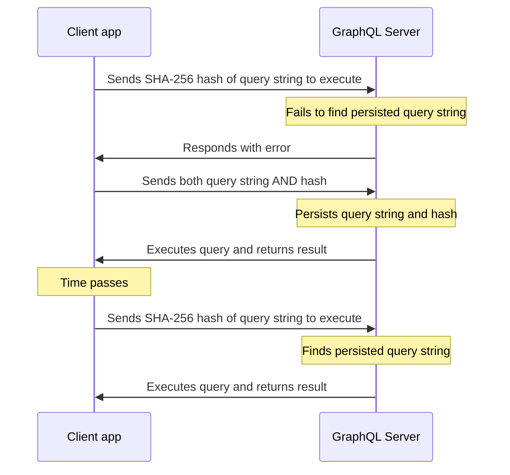

## The problem

Clients send queries to GraphQLite as HTTP requests that include the GraphQL string of the query to execute.
Depending on your graph's schema, the size of a valid query string might be arbitrarily large.
As query strings become larger, increased latency and network usage can noticeably degrade client performance.

To combat this, GraphQL servers use a technique called "persisted queries". The basic idea is instead of
sending the whole query string, clients only send it's unique identifier. The server then finds the actual
query string by given identifier and use that as if the client sent the whole query in the first place.
That helps improve GraphQL network performance with zero build-time configuration by sending smaller GraphQL HTTP requests.
A smaller request payload reduces bandwidth utilization and speeds up GraphQL Client loading times.

## Apollo APQ

[Automatic persisted queries (APQ) is technique created by Apollo](https://www.apollographql.com/docs/apollo-server/performance/apq/)
and is aimed to implement a simple automatic way of persisting queries. Queries are cached on the server side,
along with its unique identifier (always its SHA-256 hash). Clients can send this identifier instead of the
corresponding query string, thus reducing request sizes dramatically (response sizes are unaffected).

To persist a query string, GraphQLite server must first receive it from a requesting client.
Consequently, each unique query string must be sent to Apollo Server at least once.
After any client sends a query string to persist, every client that executes that query can then benefit from APQ.



Persisted queries are especially effective when clients send queries as GET requests.
This enables clients to take advantage of the browser cache and integrate with a CDN.

Because query identifiers are deterministic hashes, clients can generate them at runtime. No additional build steps are required.

## Setup

To use Automatic persisted queries with GraphQLite, you may use
`useAutomaticPersistedQueries` method when building your PSR-15 middleware:

```php
$builder = new Psr15GraphQLMiddlewareBuilder($schema);

// You need to provide a PSR compatible cache and a TTL for queries. The best cache would be some kind
// of in-memory cache with a limit on number of entries to make sure your cache can't be maliciously spammed with queries.
$builder->useAutomaticPersistedQueries($cache, new DateInterval('1H'));
```

